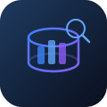

<div align="center">



# DBA Dash WebView

**A modern web dashboard for SQL Server fleet monitoring**

*Browser-based companion to [DBA Dash](https://github.com/trimble-oss/dba-dash) — monitor hundreds of SQL Servers from any device.*

[](https://github.com/BenediktSchackenberg/dbadashwebview/actions/workflows/build.yml)
[](LICENSE)
[](https://dotnet.microsoft.com/)
[](https://react.dev/)
[](https://dbadash.com)

[Features](#-features) · [Screenshots](#-screenshots) · [Quick Start](#-quick-start) · [Deployment](#-iis-deployment) · [Configuration](#-configuration) · [API Reference](#-api-reference) · [Roadmap](#-roadmap) · [Contributing](#-contributing)

---

**DBA Dash** is an outstanding open-source SQL Server monitoring tool by [Trimble](https://github.com/trimble-oss/dba-dash). **DBA Dash WebView** gives it a web UI — access your fleet's health from any browser, any device, anywhere.

</div>

---

## The Problem

DBA Dash has a powerful Windows GUI — but in modern IT environments, that's not always enough:

| Challenge | How WebView Helps |
|-----------|------------------|
| DBA Dash GUI is Windows-only | WebView runs in **any browser** — Mac, Linux, iPad, phone |
| Can't share dashboards with management | One URL, everyone sees live data — **no install required** |
| VPN required to check server health | Deploy on an internal IIS, access from anywhere on your network |
| IT managers need high-level overviews | **Management dashboards** with RPO analysis, license costs, fleet KPIs |
| Setting up monitoring views takes time | **40+ pre-built pages** for common DBA workflows |

**Zero impact on your existing setup** — WebView reads from the same `DBADashDB` your collectors already write to. No additional agents, no schema changes, no configuration needed on monitored servers.

---

## ✨ Features

### DBA Dash-Style Navigation
Full instance tree sidebar — grouped by SQL Server version (2025, 2022, 2019…), each instance expandable with categories: Configuration, HA/DR, Storage, Databases, Backups, Jobs, Reports. Click any node → filtered view for that server only.

### Performance Summary Dashboard
Real-time overview of your entire fleet in a single table — CPU, waits, IO latency, IOPs per instance. Sortable columns, auto-refresh every 30 seconds, user-configurable warning/critical color thresholds.

### Management Reporting
Three purpose-built reports designed for **IT managers and decision-makers**:

- **License Overview** — SQL Server version/edition distribution, total core & RAM counts, end-of-support timeline with color-coded urgency
- **Underutilized Servers** — Instances averaging <5% CPU over 14 days, with estimated annual savings per server (Enterprise: ~$15K/core, Standard: ~$4K/core)
- **Fleet Statistics** — CPU distribution buckets, top 10 consumers, RAM/storage allocation across the fleet

### Backup & Recovery Overview
Management-grade backup dashboard sorted by CPU load (business-critical servers first):

- **Expandable instance cards** — click to see every database's Full/Diff/Log backup status
- **RPO indicators** — Excellent / Good / OK / Warning / Critical per database
- **Recovery time estimates** — calculated from backup duration and size
- **KPI cards** — backups in last 24h, total backup size, average recovery time
- **Recovery Impact Assessment** — worst-case recovery time, databases with RPO gaps

### Performance Deep-Dive
- **Running Queries** — Live view of executing queries with blocking detection
- **Blocking Analysis** — Tree view of blocking chains, root blockers highlighted
- **Slow Queries** — Extended Events data with duration/DB/application filters
- **Wait Statistics** — Stacked area chart of wait types over time
- **Memory** — Buffer pool, PLE trends, memory clerk breakdown
- **IO Performance** — Read/write latency charts, IOPS, throughput per file
- **Object Execution Stats** — Stored procedure and function performance
- **Performance Counters** — Custom counter monitoring with trend charts
- **Query Store** — Top resource consumers from Query Store data

### Daily Health Checks
- **Backup Status** — Full/Diff/Log backup age per database, RPO compliance
- **Agent Jobs** — Job history with Gantt-style timeline visualization
- **Drive Space** — Capacity monitoring with usage percentage and color thresholds
- **Database Space** — File-level space tracking with growth analysis
- **TempDB** — File configuration and usage monitoring
- **Alerts** — Alert inbox with severity filtering and acknowledgement

### Tracking & Compliance
- **Configuration Tracking** — Detect sp_configure changes with before/after diff
- **SQL Patching** — Version distribution across fleet, patch history timeline
- **Schema Changes** — DDL change history timeline
- **Identity Columns** — Usage percentage with threshold alerts

### Administration
- **Configurable Thresholds** — Define warning/critical levels per metric — no colors until you set them
- **Active Directory Authentication** — LDAP integration with group-based roles
- **Local + AD Auth** — Hardcoded admin fallback when AD is down
- **Server Management** — View monitored instances and connection details
- **Groups & Tags** — Organize instances for filtering
- **Users & RBAC** — Admin / Operator / Viewer roles
- **Data Retention** — Configure cleanup per data category

### User Experience
- **Command Palette** (Ctrl+K) — Instant fuzzy search across instances, databases, jobs
- **Auto-Refresh** — 30-second intervals with countdown indicator
- **Dark Theme** — Glassmorphism design, optimized for NOC/SOC wall displays
- **Instance-Aware Navigation** — Tree links pre-select the instance, no manual dropdowns
- **Responsive** — Collapsible sidebar, works on tablets
- **Fast** — React 19 + Vite, sub-second page transitions

---

## 📸 Screenshots

> *Coming soon — deployment screenshots from a 200+ SQL Server environment.*

---

## 🚀 Quick Start

### Prerequisites

| Requirement | Version |
|-------------|---------|
| [DBA Dash](https://github.com/trimble-oss/dba-dash) | Any (populated DBADashDB required) |
| [.NET 8 Runtime](https://dotnet.microsoft.com/download/dotnet/8.0) | 8.0+ (Hosting Bundle for IIS) |
| SQL Server | 2012+ |

### Download & Run

1. Download the latest release from [Releases](https://github.com/BenediktSchackenberg/dbadashwebview/releases)
2. Extract the ZIP
3. Edit `appsettings.json`:

```json
{
  "ConnectionStrings": {
    "DBADashDB": "Server=YOUR_SQL_SERVER;Database=DBADashDB;User Id=YOUR_USER;Password=YOUR_PASSWORD;TrustServerCertificate=true;"
  }
}
```

4. Deploy to IIS (see below) or run standalone:
```bash
dotnet DBADashWebView.dll
# Open http://localhost:5000
```

5. Login with `admin` / `admin` (change this in production!)

---

## 🖥️ IIS Deployment

### 1. Install the ASP.NET Core Hosting Bundle

Download from [Microsoft](https://dotnet.microsoft.com/download/dotnet/8.0) → **Hosting Bundle** (not just Runtime).

```powershell
iisreset  # Required after installing the Hosting Bundle
```

### 2. Create the IIS Site

```powershell
# Extract release
Expand-Archive -Path dbadash-webview.zip -DestinationPath C:\inetpub\dbadash

# Create App Pool (No Managed Code)
Import-Module WebAdministration
New-WebAppPool -Name "DBADashWebView"
Set-ItemProperty "IIS:\AppPools\DBADashWebView" -Name "managedRuntimeVersion" -Value ""

# Create Website
New-Website -Name "DBADashWebView" -PhysicalPath "C:\inetpub\dbadash" `
            -ApplicationPool "DBADashWebView" -Port 8080

# Grant read permissions
icacls "C:\inetpub\dbadash" /grant "IIS AppPool\DBADashWebView:(OI)(CI)R" /T
```

### 3. Configure Connection String

Edit `C:\inetpub\dbadash\appsettings.json` — set your DBADashDB server, credentials, and add `Encrypt=false` if using SQL authentication without TLS.

### 4. Browse to `http://your-server:8080`

### Troubleshooting

| Symptom | Fix |
|---------|-----|
| 502.5 / 500.30 | Install the Hosting Bundle, then `iisreset` |
| Blank page, no errors | Check connection string — server reachable? Correct DB name? |
| No instances showing | SQL user needs `db_datareader` on DBADashDB |
| "HTTP Error 500.19" | Hosting Bundle not installed or `web.config` invalid |
| Login fails | Default credentials: `admin` / `admin` |
| CORS errors | Deploy frontend and backend together (same origin) |

Enable detailed logging:
```xml
<!-- In web.config -->
<aspNetCore stdoutLogEnabled="true" stdoutLogFile=".\logs\stdout" ... />
```

---

## ⚙️ Configuration

### SQL Server Permissions

WebView needs **read-only** access to DBADashDB:

```sql
USE DBADashDB;
CREATE LOGIN [dbadashweb] WITH PASSWORD = 'YourSecurePassword';
CREATE USER [dbadashweb] FOR LOGIN [dbadashweb];
ALTER ROLE db_datareader ADD MEMBER [dbadashweb];
GRANT EXECUTE ON SCHEMA::dbo TO [dbadashweb];
```

### Active Directory Authentication

Configure via **Settings → Users → LDAP tab**, or directly edit `config/ad-config.json`:

```json
{
  "Enabled": true,
  "Server": "ldap://dc01.corp.local",
  "BaseDN": "DC=corp,DC=local",
  "BindUser": "CN=svc-dbadash,OU=Service,DC=corp,DC=local",
  "AdminGroup": "CN=DBA-Admins,OU=Groups,DC=corp,DC=local",
  "AllowLocalFallback": true
}
```

When `AllowLocalFallback` is true, the built-in `admin` account still works when AD is unreachable.

### Dashboard Thresholds

Configure via **Settings → Thresholds**. Define warning and critical levels per metric (CPU %, IO latency, wait ms, etc.). **Cells remain neutral/uncolored** until you explicitly set thresholds — no surprise colors out of the box.

---

## 📡 API Reference

All endpoints require JWT authentication via `Authorization: Bearer <token>` header.

<details>
<summary><strong>Authentication</strong></summary>

```
POST /api/auth/login              { "username": "...", "password": "..." }  →  { "token": "..." }
GET  /api/health                  Health check (no auth required)
```
</details>

<details>
<summary><strong>Dashboard & Navigation</strong></summary>

```
GET /api/dashboard/stats                    KPIs, top CPU, largest DBs, alerts
GET /api/dashboard/performance-summary      Performance summary table
GET /api/tree                               Instance tree with databases (for sidebar)
GET /api/instances                          All instances with version info
GET /api/instances/{id}                     Instance detail
```
</details>

<details>
<summary><strong>Per-Instance Data</strong></summary>

```
GET /api/instances/{id}/cpu
GET /api/instances/{id}/waits
GET /api/instances/{id}/drives
GET /api/instances/{id}/databases
GET /api/instances/{id}/backups
GET /api/instances/{id}/jobs
GET /api/instances/{id}/queries
```
</details>

<details>
<summary><strong>Performance Monitoring</strong></summary>

```
GET /api/performance/running-queries?instanceId=
GET /api/performance/blocking?instanceId=
GET /api/performance/slow-queries?instanceId=&hours=24
GET /api/performance/memory?instanceId=
GET /api/performance/io?instanceId=
GET /api/performance/exec-stats?instanceId=&hours=24
GET /api/performance/waits-timeline?instanceId=&hours=24
GET /api/performance/counters?instanceId=&hours=24
GET /api/performance/query-store?instanceId=
```
</details>

<details>
<summary><strong>Monitoring & Tracking</strong></summary>

```
GET /api/monitoring/job-timeline?instanceId=&hours=24
GET /api/monitoring/configuration?instanceId=
GET /api/monitoring/configuration/changes?instanceId=&days=30
GET /api/monitoring/patching
GET /api/monitoring/schema-changes?instanceId=&days=30
GET /api/monitoring/identity-columns?instanceId=
GET /api/monitoring/tempdb?instanceId=
GET /api/monitoring/db-space?instanceId=
```
</details>

<details>
<summary><strong>Estate & Reporting</strong></summary>

```
GET /api/alerts/recent
GET /api/jobs/recent
GET /api/jobs/failures
GET /api/drives
GET /api/backups/estate
GET /api/backups/management            Backup & Recovery management view
GET /api/availability-groups
GET /api/availability-groups/{id}
GET /api/reports/licenses              License & version overview
GET /api/reports/underutilized         Underutilized server analysis
GET /api/reports/fleet-stats           Fleet resource statistics
```
</details>

<details>
<summary><strong>Settings</strong></summary>

```
GET  /api/settings/ad                  AD/LDAP configuration
POST /api/settings/ad                  Update AD config
POST /api/settings/ad/test             Test AD login
GET  /api/settings/thresholds          Dashboard thresholds
POST /api/settings/thresholds          Update thresholds
```
</details>

---

## 🏗️ Architecture

```
┌──────────────────┐       ┌──────────────────┐       ┌─────────────────┐
│                  │       │                  │       │                 │
│  Browser         │──────▶│  ASP.NET Core 8  │──────▶│   DBADashDB     │
│  (React SPA)     │  JWT  │  (Minimal API)   │  SQL  │   (SQL Server)  │
│                  │       │                  │       │                 │
└──────────────────┘       └──────────────────┘       └────────┬────────┘
                                  │                            │
                             IIS / Kestrel              DBA Dash Agents
                             Static files               (your collectors)
                             Read-only queries                 │
                                                     ┌────────┴────────┐
                                                     │  Your SQL       │
                                                     │  Server Fleet   │
                                                     │  (10–1000+)     │
                                                     └─────────────────┘
```

| Layer | Technology |
|-------|-----------|
| **Frontend** | React 19, TypeScript, Vite, Tailwind CSS 4, Recharts, Framer Motion, Lucide Icons |
| **Backend** | ASP.NET Core 8 Minimal API, Microsoft.Data.SqlClient |
| **Auth** | JWT tokens + optional LDAP/Active Directory |
| **Deployment** | IIS with ASP.NET Core Hosting Module |
| **CI/CD** | GitHub Actions → ZIP artifact → GitHub Release |

### Page Count

| Category | Pages |
|----------|-------|
| Dashboard & Navigation | 3 |
| Performance Monitoring | 10 |
| Daily Health Checks | 6 |
| Tracking & Compliance | 4 |
| Management Reporting | 3 |
| Estate Views | 4 |
| Administration | 6 |
| **Total** | **40+** |

---

## 🔨 Building from Source

```bash
git clone https://github.com/BenediktSchackenberg/dbadashwebview.git
cd dbadashwebview

# Frontend
cd frontend
npm install
npm run build
cd ..

# Backend (publishes to ./publish)
cd backend
dotnet publish -c Release -o ../publish
cd ..

# Combine: copy SPA into wwwroot
cp -r frontend/dist/* publish/wwwroot/
```

The `publish/` folder is ready for IIS deployment.

---

## 🗺️ Roadmap

- [ ] Scheduled PDF reports via email
- [ ] Multi-tenant support (multiple DBADashDB repositories)
- [ ] Custom dashboard layouts (drag & drop widgets)
- [ ] Webhook / Teams / Slack notifications
- [ ] Dark/Light theme toggle
- [ ] Grafana-style alerting rules
- [ ] REST API for external integrations
- [ ] Real-time SignalR push updates
- [ ] Export to CSV/Excel from any table

---

## 🤝 Contributing

Contributions welcome! Fork the repo, create a feature branch, and submit a PR.

```bash
git checkout -b feature/my-feature
git commit -m 'feat: add my feature'
git push origin feature/my-feature
```

Please ensure `npm run build` and `dotnet build` pass before submitting.

---

## 🙏 Acknowledgements

**[DBA Dash](https://github.com/trimble-oss/dba-dash)** by [David Wiseman](https://github.com/DavidWisworker) / [Trimble](https://github.com/trimble-oss) — the outstanding open-source SQL Server monitoring tool that provides all the data WebView visualizes. Licensed under Apache 2.0.

If you're not using DBA Dash yet, [check it out](https://dbadash.com) — it's one of the best tools available for SQL Server monitoring.

DBA Dash WebView is an **independent project** that provides a web frontend for DBA Dash data. It is not affiliated with or endorsed by Trimble or the DBA Dash project.

---

## 📄 License

[MIT](LICENSE) — DBA Dash WebView

[Apache 2.0](https://github.com/trimble-oss/dba-dash/blob/main/LICENSE) — DBA Dash

---

<div align="center">

**Built by [Benedikt Schackenberg](https://github.com/BenediktSchackenberg)**

*If this project helps you, give it a ⭐!*

</div>
