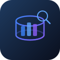

<div align="center">



# DBA Dash WebView

**A modern web dashboard for SQL Server fleet monitoring**

*Browser-based companion to [DBA Dash](https://github.com/trimble-oss/dba-dash) — monitor hundreds of SQL Servers from any device.*

[](https://github.com/BenediktSchackenberg/dbadashwebview/actions/workflows/build.yml)
[](LICENSE)
[](https://dotnet.microsoft.com/)
[](https://react.dev/)
[](https://dbadash.com)

[Features](#-features) · [Quick Start](#-quick-start) · [Deployment](#%EF%B8%8F-iis-deployment) · [Updating](#updating-an-existing-iis-deployment) · [Configuration](#%EF%B8%8F-configuration) · [API Reference](#-api-reference) · [Roadmap](#%EF%B8%8F-roadmap) · [Contributing](#-contributing)

---

**DBA Dash** is an outstanding open-source SQL Server monitoring tool by [Trimble](https://github.com/trimble-oss/dba-dash). **DBA Dash WebView** gives it a web UI — access your fleet's health from any browser, any device, anywhere.

</div>

---

## The Problem

DBA Dash has a powerful Windows GUI — but in modern IT environments, that's not always enough:

| Challenge | How WebView Helps |
|-----------|------------------|
| DBA Dash GUI is Windows-only | WebView runs in **any browser** — Mac, Linux, iPad, phone |
| Can't share dashboards with management | One URL, everyone sees live data — **no install required** |
| VPN required to check server health | Deploy on an internal IIS, access from anywhere on your network |
| IT managers need high-level overviews | **Management dashboards** with RPO analysis, license costs, fleet KPIs |
| Setting up monitoring views takes time | **46 pre-built pages** for common DBA workflows |

**Zero impact on your existing setup** — WebView reads from the same `DBADashDB` your collectors already write to. No additional agents, no schema changes, no configuration needed on monitored servers.

---

## ✨ Features

### 📋 Summary Dashboard (NEW)
The first thing you see — a faithful recreation of DBA Dash's original Summary tab. Status matrix showing OK / Warning / Critical / N/A / Acknowledged counts for every health check across your fleet. One glance tells you where to focus.

Uses `dbo.Summary_Get` stored procedure with correct `DBADashStatusEnum` mapping:
- **1 = Critical** (red), **2 = Warning** (yellow), **3 = N/A** (gray), **4 = OK** (green), **5 = Acknowledged** (blue)

Health checks tracked: Backup FULL/DIFF/LOG, Drive Space, File Space, Log Space, Agent Jobs, Availability Groups, Corruption, Last Good CheckDB, Memory Dump, Snapshot Age, Instance Uptime, Agent Running, DB Mail, Query Store, SQL Agent Alerts, % Max Size, Collection Errors, Database State, Identity Columns, Log Shipping, Custom Checks, Mirroring, Elastic Pool Storage.

### 🖥️ Tabbed Dashboard
The main dashboard mirrors the DBA Dash GUI with **5 tabs** — exactly like the original:

1. **Summary** — status matrix with instance counts per health check
2. **Alerts** — unified error feed (collection errors + failed jobs)
3. **Performance Summary** — fleet-wide CPU, waits, IO latency table (sorted by Max CPU)
4. **Slow Queries** — Extended Events slow query data
5. **Running Queries** — live executing queries with blocking detection

All tabs auto-refresh every 30 seconds with countdown indicator.

### 🖥️ SQL Monitor Dashboard
Real-time fleet overview inspired by Redgate SQL Monitor — card-based grid showing all instances with health indicators, CPU usage, and status at a glance. Alert sidebar with live error feed. Click any card to drill into instance details.

### 🌳 DBA Dash-Style Navigation
Full instance tree sidebar — grouped by SQL Server version (2025, 2022, 2019…), each instance expandable with categories: Configuration, HA/DR, Storage, Databases, Backups, Jobs, Reports. Click any node → filtered view for that server only.

### 🚦 Backup Ampel Report
Traffic-light backup compliance across the entire fleet:

- **Per-instance ampel status** — GREEN (Full ≤24h & Log ≤1h), YELLOW (Full ≤48h & Log ≤2h), RED (everything else)
- **AlwaysOn-aware** — AG secondaries correctly excluded from backup evaluation (backups run on preferred replica)
- **Simple Recovery handling** — databases without log backups show N/A, not RED
- **RPO analysis** — average and worst-case RPO across the fleet, distribution charts
- **Expandable per-database details** — drill into any instance to see individual DB backup status, AG role, TDE, recovery model
- **Interactive pie charts** — click to filter by status

### 🔄 AlwaysOn Availability Groups
Fleet-wide AG overview with cluster visualization:

- **Cluster cards** with server topology — Primary/Secondary roles, CPU bars, RAM, availability mode
- **Database sync state** — SYNCHRONIZED, SYNCHRONIZING, NOT SYNCHRONIZING with health indicators
- **Lag monitoring** — log send queue, redo queue, send/redo rates per database
- **Search** — filter across server names, AG names, and database names
- **Per-instance HA/DR view** — click through to individual server AG details

### 📈 Instance Detail Pages
Comprehensive per-instance view with tabbed navigation:

- **Performance** (default tab) — CPU chart (24h), wait type analysis, CPU KPIs
- **Backups** — per-database backup status grouped by DB with Full/Diff/Log age, AG-aware
- **Jobs** — filterable by status (All/Failed/Success), duration, messages
- **Databases** — state, recovery model, AG role, sync state, last DBCC
- **Drives** — visual capacity cards with usage percentage and color coding (instance-filtered when navigating from tree)

### 🚨 Alerts & Errors
Unified alert feed combining Collection Errors and Failed Jobs:

- **Severity filtering** — Critical, Warning, Info with KPI counters
- **Type filtering** — Collection errors vs failed jobs
- **Detail panel** — click any alert for full error message, context, server link
- **Server breakdown** — which instances generate the most alerts
- **Auto-refresh 30s** — newest alerts always on top

### 📋 Management Reporting
Purpose-built reports for IT managers:

- **Fleet Statistics** — CPU distribution, top consumers, RAM/storage allocation, version/edition pie charts
- **License Overview** — SQL Server edition distribution, core & RAM totals, end-of-support timeline
- **Underutilized Servers** — instances averaging <5% CPU, candidates for consolidation or downsizing
- **Backup & Recovery Overview** — RPO compliance, recovery time estimates, expandable instance cards

### 🔍 Performance Deep-Dive
- **Running Queries** — live executing queries with blocking detection
- **Blocking Analysis** — tree view of blocking chains, root blockers highlighted
- **Slow Queries** — Extended Events data with duration/DB/application filters
- **Wait Statistics** — stacked area chart of wait types over time
- **Memory** — buffer pool, PLE trends, memory clerk breakdown
- **IO Performance** — read/write latency charts, IOPS, throughput per file
- **Object Execution Stats** — stored procedure and function performance
- **Performance Counters** — custom counter monitoring with trend charts
- **Query Store** — top resource consumers from Query Store data

### 📅 Daily Health Checks
- **Backup Status** — Full/Diff/Log backup age per database, RPO compliance
- **Agent Jobs** — job history with Gantt-style timeline visualization
- **Drive Space** — capacity monitoring with usage percentage and color thresholds
- **Database Space** — file-level space tracking with growth analysis
- **TempDB** — file configuration and usage monitoring

### 🔬 Tracking & Compliance
- **Configuration Tracking** — detect sp_configure changes with before/after diff
- **SQL Patching** — version distribution across fleet, patch history timeline
- **Schema Changes** — DDL change history timeline
- **Identity Columns** — usage percentage with threshold alerts

### ⚙️ Administration
- **Configurable Thresholds** — define warning/critical levels per metric
- **Active Directory Authentication** - LDAP integration with Admin / Operator / Viewer role mapping
- **Local + AD Auth** - persisted local users with hashed passwords and optional AD fallback
- **Server Management** — view monitored instances and connection details
- **Groups & Tags** — organize instances for filtering
- **Users & RBAC** — Admin / Operator / Viewer roles
- **Data Retention** — configure cleanup per data category

### 🎨 User Experience
- **Command Palette** (Ctrl+K) — instant fuzzy search across instances, databases, jobs
- **Auto-Refresh** — 30-second intervals with countdown indicator, diff-based updates (no full page remount)
- **Dark Theme** — glassmorphism design, optimized for NOC/SOC wall displays
- **Framer Motion** — smooth page transitions and animated list items
- **Instance-Aware Navigation** — tree links filter to selected instance (drives, backups, config)
- **Responsive** — collapsible sidebar, works on tablets
- **Fast** — React 19 + Vite, sub-second page transitions

---

## 🚀 Quick Start

### Prerequisites

| Requirement | Version |
|-------------|---------|
| [DBA Dash](https://github.com/trimble-oss/dba-dash) | Any (populated DBADashDB required) |
| [.NET 10 Runtime](https://dotnet.microsoft.com/download/dotnet/10.0) | 10.0+ (Hosting Bundle for IIS) |
| SQL Server | 2012+ |

### 1) Download and extract

Download `dbadash-webview.zip` from the latest [GitHub Release](https://github.com/BenediktSchackenberg/dbadashwebview/releases) and extract it to your target folder. Release assets are the recommended deployment packages; [GitHub Actions artifacts](https://github.com/BenediktSchackenberg/dbadashwebview/actions) are temporary CI outputs intended for testing.

### 2) Configure `appsettings.json`

Open `appsettings.json` in the extracted folder. At minimum, set these required fields:

| JSON field | Required | What it does | Example |
|------------|----------|--------------|---------|
| `ConnectionStrings.DBADashDB` | ✅ Yes | SQL connection string to your DBA Dash repository DB | `Server=SQL01;Database=DBADashDB;Trusted_Connection=True;TrustServerCertificate=true;` |
| `Jwt.Secret` | ✅ Yes | Secret used to sign login tokens (JWT) | `very-long-random-secret-with-32-plus-characters` |
| `LocalAuth.BootstrapAdminPassword` | ✅ Yes (first start) | Initial admin password used once to bootstrap the first local admin user | `UseAStrongTempPassword!` |
| `LocalAuth.BootstrapAdminUsername` | Recommended | Username for the bootstrap admin | `admin` |
| `LocalAuth.BootstrapAdminDisplayName` | Recommended | Display name shown in UI | `Administrator` |
| `LocalAuth.UserStorePath` | Recommended | Path where local users are stored | `config/local-users.json` |

Minimal working example:

```json
{
  "ConnectionStrings": {
    "DBADashDB": "Server=YOUR_SQL_SERVER;Database=DBADashDB;Trusted_Connection=True;TrustServerCertificate=true;"
  },
  "Jwt": {
    "Secret": "replace-with-a-long-random-string-min-32-chars"
  },
  "LocalAuth": {
    "Enabled": true,
    "UserStorePath": "config/local-users.json",
    "BootstrapAdminUsername": "admin",
    "BootstrapAdminDisplayName": "Administrator",
    "BootstrapAdminPassword": "your-initial-password-here"
  }
}
```

> **Important:** WebView will not start correctly without `ConnectionStrings.DBADashDB` and `Jwt.Secret`.  
> `LocalAuth.BootstrapAdminPassword` is only needed to create the first local admin account.

### 3) Start the app

**Standalone (test/dev):**
```powershell
dotnet DBADashWebView.dll
# Open http://localhost:5000
```

**IIS (production):** follow [IIS Deployment](#-iis-deployment) below.

### 4) First login and cleanup

1. Sign in with:
   - **Username:** value from `LocalAuth.BootstrapAdminUsername` (default `admin`)
   - **Password:** value from `LocalAuth.BootstrapAdminPassword`
2. Go to **Settings → Users** and create your permanent users/accounts.
3. Remove `BootstrapAdminPassword` from `appsettings.json` after bootstrap is complete.

### 5) Verify data access

If login works but dashboards are empty, check:
- the SQL login in your connection string can read `DBADashDB`
- DBA Dash collectors are writing fresh data
- firewall/network allows the app server to reach SQL Server

---

## 🧭 Feature Mapping (DBA Dash Windows → Web)

The table below maps common DBA Dash Windows areas to their WebView equivalent pages/routes.

| DBA Dash (Windows) | WebView page | Route |
|--------------------|--------------|-------|
| Summary tab (status matrix) | Summary Dashboard | `/` |
| SQL Monitor-style instance overview | SQL Monitor | `/monitor` |
| Alerts / check failures / failed jobs | Alerts | `/alerts` |
| Instance details (checks overview) | Instance Detail | `/instances/:id` |
| Instance → Backups | Instance Backups | `/instances/:id/backups` |
| Instance → Drives / storage | Instance Drives | `/instances/:id/drives` |
| Instance → Configuration | Configuration (instance) | `/instances/:id/configuration` |
| Instance → HA/DR | Availability Groups (instance) | `/instances/:id/hadr` |
| Instance → Jobs | Job Timeline (instance) | `/instances/:id/jobs` |
| Running Queries | Running Queries | `/performance/running-queries` |
| Blocking | Blocking Analysis | `/performance/blocking` |
| Slow Queries | Slow Queries | `/performance/slow-queries` |
| Wait Statistics | Waits Timeline | `/performance/waits-timeline` |
| Memory | Memory | `/performance/memory` |
| IO Performance | IO Performance | `/performance/io` |
| Query Store | Query Store | `/performance/query-store` |
| Backup Ampel / estate backup health | Backup Ampel Report | `/reports/backup-ampel` |
| Availability Groups (fleet-wide) | AlwaysOn Overview | `/availability-groups` |
| License reporting | License Overview | `/reports/licenses` |
| Underutilized server analysis | Underutilized Servers | `/reports/underutilized` |
| Fleet health/resource summary | Fleet Statistics | `/reports/fleet-stats` |
| Configuration tracking changes | Schema/Config Monitoring | `/monitoring/configuration`, `/monitoring/schema-changes` |
| Identity columns tracking | Identity Columns | `/monitoring/identity-columns` |
| TempDB monitoring | TempDB | `/monitoring/tempdb` |
| Database space tracking | Database Space | `/monitoring/db-space` |
| Threshold configuration | Threshold Settings | `/settings/thresholds` |
| User management / RBAC | Users Settings | `/settings/users` |

> Notes:
> - `:id` in routes means the numeric instance ID.
> - Some workflows are split into dedicated pages in WebView instead of one combined Windows tab.

---

### Development in Visual Studio

Open `DBADashWebView.sln` from the repository root to load the ASP.NET Core backend and the xUnit test project in Visual Studio. The React/Vite SPA remains in `frontend/`; run `npm install` once and use `npm run dev` or `npm run build` from that folder for frontend work.

```powershell
dotnet build DBADashWebView.sln
dotnet test DBADashWebView.sln
```

---

## 🖥️ IIS Deployment

### 1. Install the ASP.NET Core Hosting Bundle

Download from [Microsoft](https://dotnet.microsoft.com/download/dotnet/10.0) → **Hosting Bundle** (not just Runtime).

```powershell
iisreset  # Required after installing the Hosting Bundle
```

### 2. Create the IIS Site

```powershell
# Extract release
Expand-Archive -Path dbadash-webview.zip -DestinationPath C:\inetpub\dbadash

# Create App Pool (No Managed Code)
Import-Module WebAdministration
New-WebAppPool -Name "DBADashWebView"
Set-ItemProperty "IIS:\AppPools\DBADashWebView" -Name "managedRuntimeVersion" -Value ""

# Create Website
New-Website -Name "DBADashWebView" -PhysicalPath "C:\inetpub\dbadash" `
            -ApplicationPool "DBADashWebView" -Port 8080

# Grant read/execute permission to the application and modify permission to runtime state
icacls "C:\inetpub\dbadash" /grant "IIS AppPool\DBADashWebView:(OI)(CI)RX" /T
New-Item -ItemType Directory -Path "C:\inetpub\dbadash\config" -Force | Out-Null
icacls "C:\inetpub\dbadash\config" /grant "IIS AppPool\DBADashWebView:(OI)(CI)M" /T
```

### 3. Configure Connection String

Edit `C:\inetpub\dbadash\appsettings.json` — set your DBADashDB server, credentials, and add `Encrypt=false` if using SQL authentication without TLS.

### 4. Browse to `http://your-server:8080`

### Troubleshooting

| Symptom | Fix |
|---------|-----|
| 502.5 / 500.30 | Install the Hosting Bundle, then `iisreset` |
| Blank page, no errors | Check connection string — server reachable? Correct DB name? |
| No instances showing | SQL user needs `db_datareader` on DBADashDB |
| "HTTP Error 500.19" | Hosting Bundle not installed or `web.config` invalid |
| Login fails | Verify `Jwt__Secret`, the DB connection string, and whether the first local admin has been bootstrapped |
| CORS errors | Deploy frontend and backend together (same origin) |

Enable detailed logging:
```xml
<!-- In web.config -->
<aspNetCore stdoutLogEnabled="true" stdoutLogFile=".\logs\stdout" ... />
```

---

## Updating an Existing IIS Deployment

DBA Dash WebView only reads from `DBADashDB`. Application updates don't run database migrations or change the DBA Dash schema, so an update is an application-file replacement and can be rolled back to an earlier release.

Don't delete the existing site directory before preserving its state. The release ZIP contains new defaults for `appsettings.json` and `web.config`, while the deployment's `config/` directory contains runtime state such as:

- `ad-config.json` — Active Directory settings and the protected bind password
- `local-users.json` — local accounts and password hashes
- `thresholds.json` — dashboard threshold settings

If `LocalAuth.UserStorePath` points outside the deployment directory, back up that configured file separately.

### 1. Download and stage the new release

Use the ZIP attached to the desired [GitHub Release](https://github.com/BenediktSchackenberg/dbadashwebview/releases), not the source-code archives. Run the following update commands in the same elevated PowerShell session and extract the release to a temporary directory first:

```powershell
$releaseZip = "C:\Temp\dbadash-webview.zip"
$stagingPath = "C:\Temp\dbadash-webview-new"

Expand-Archive -Path $releaseZip -DestinationPath $stagingPath -Force
```

Release ZIPs produced by the current build workflow include `version.txt`. After deployment, this file identifies the installed release tag; CI artifacts built from a branch contain the source commit SHA instead. Older deployments may not have this file; the About page and the verification command below automatically fall back to the assembly build information in that case.

### 2. Back up configuration and runtime state

Run PowerShell as an administrator and store the backup outside the IIS site directory:

```powershell
$sitePath = "C:\inetpub\dbadash"
$backupPath = "C:\dbadash-backups\$(Get-Date -Format 'yyyyMMdd-HHmmss')"

New-Item -ItemType Directory -Path $backupPath -Force | Out-Null
Copy-Item "$sitePath\appsettings.json" $backupPath -Force
Copy-Item "$sitePath\web.config" $backupPath -Force
if (Test-Path "$sitePath\config") {
    Copy-Item "$sitePath\config" $backupPath -Recurse -Force
}
if (Test-Path "$sitePath\version.txt") {
    Copy-Item "$sitePath\version.txt" $backupPath -Force
}
```

Keep the previous release ZIP until the update has been verified.

### 3. Stop the application and replace its files

IIS locks loaded DLLs, so stop the application pool before copying the new files:

```powershell
Import-Module WebAdministration
Stop-WebAppPool -Name "DBADashWebView"

Copy-Item "$stagingPath\*" $sitePath -Recurse -Force
```

Alternatively, placing an `app_offline.htm` file in the site root gracefully stops the application. Wait for the worker process to exit before replacing files, then remove `app_offline.htm` when the update is complete.

### 4. Restore state and permissions

Restore the deployment-specific files after copying the release:

```powershell
Copy-Item "$backupPath\appsettings.json" "$sitePath\appsettings.json" -Force
Copy-Item "$backupPath\web.config" "$sitePath\web.config" -Force
if (Test-Path "$backupPath\config") {
    New-Item -ItemType Directory -Path "$sitePath\config" -Force | Out-Null
    Copy-Item "$backupPath\config\*" "$sitePath\config" -Recurse -Force
}

icacls $sitePath /grant "IIS AppPool\DBADashWebView:(OI)(CI)RX" /T
if (Test-Path "$sitePath\config") {
    icacls "$sitePath\config" /grant "IIS AppPool\DBADashWebView:(OI)(CI)M" /T
}
```

Compare the new `$stagingPath\appsettings.json` with the restored file and add any settings introduced by the new release while keeping your connection string, JWT secret, and local-auth configuration.

The application needs modify permission on `config/` to save users, AD settings, and thresholds. If detailed stdout logging is enabled, grant modify permission on the configured logs directory as well.

### 5. Start and verify

```powershell
Start-WebAppPool -Name "DBADashWebView"
Invoke-RestMethod "http://localhost:8080/api/health"
$installedVersion = if (Test-Path "$sitePath\version.txt") {
    Get-Content "$sitePath\version.txt"
} else {
    (Get-Item "$sitePath\DBADashWebView.dll").VersionInfo.ProductVersion
}
$installedVersion
```

Then verify that:

- local and AD sign-in work
- existing local users are still present
- dashboards load data
- AD group mappings and saved thresholds still work

An `iisreset` isn't required for a normal application update. Use it only when changing IIS or the ASP.NET Core Hosting Bundle.

### Data Protection and AD bind passwords

The bind password in `config/ad-config.json` is encrypted with ASP.NET Core Data Protection. For IIS deployments, the keyring is normally stored outside the site directory and tied to the app-pool identity, so replacing application files on the same server and app pool preserves it. If you move the deployment to another server, change the app-pool identity, or lose the keyring, re-enter and save the AD bind password after the update. See [Microsoft's IIS Data Protection guidance](https://learn.microsoft.com/aspnet/core/host-and-deploy/iis/advanced#data-protection) for persistent keyring options.

### Rollback

Stop the app pool, extract the previous release ZIP over the site, restore the same backup of `appsettings.json`, `web.config`, and `config/`, then start the app pool again. No database rollback is required.

---

## ⚙️ Configuration

### SQL Server Permissions

WebView needs **read-only** access to DBADashDB:

```sql
USE DBADashDB;
CREATE LOGIN [dbadashweb] WITH PASSWORD = 'YourSecurePassword';
CREATE USER [dbadashweb] FOR LOGIN [dbadashweb];
ALTER ROLE db_datareader ADD MEMBER [dbadashweb];
GRANT EXECUTE ON SCHEMA::dbo TO [dbadashweb];
```

### Active Directory Authentication

Configure via **Settings -> Users -> Active Directory**, or directly edit `config/ad-config.json`:

```json
{
  "Enabled": true,
  "Server": "dc01.corp.local",
  "Domain": "corp.local",
  "BaseDn": "DC=corp,DC=local",
  "BindUser": "CN=svc-dbadash,OU=Service,DC=corp,DC=local",
  "RequiredGroup": "DBADash-Users",
  "OperatorGroup": "DBA-Operators",
  "AdminGroup": "DBA-Admins",
  "AllowLocalFallback": true
}
```

Group mappings accept either the plain group name (recommended) or the full distinguished name. Nested Active Directory groups are resolved automatically.

Bind passwords are stored protected on the server. Local users are stored in `config/local-users.json` with hashed passwords.

### Local Authentication Bootstrap

Set `LocalAuth__BootstrapAdminPassword` once before first start to seed the first admin account. After you can sign in, create permanent users in **Settings -> Users**, then remove the bootstrap password from configuration.

### Dashboard Thresholds

Configure via **Settings → Thresholds**. Define warning and critical levels per metric (CPU %, IO latency, wait ms, etc.). **Cells remain neutral/uncolored** until you explicitly set thresholds — no surprise colors out of the box.

---

## 📡 API Reference

Protected endpoints require JWT authentication via an `Authorization: Bearer <token>` header. Health, version, and authentication bootstrap endpoints are public.

<details>
<summary><strong>Authentication</strong></summary>

```
GET  /api/auth/status             Returns auth/bootstrap status
POST /api/auth/login              { "username": "...", "password": "..." }  ->  { "token": "...", "role": "Admin|Operator|Viewer" }
GET  /api/health                  Health check (no auth required)
GET  /api/version                 Installed release or assembly build version (no auth required)
```
</details>

<details>
<summary><strong>Dashboard & Navigation</strong></summary>

```
GET /api/dashboard/summary                  Raw Summary_Get (status matrix data)
GET /api/dashboard/stats                    KPIs, top CPU, largest DBs, alerts
GET /api/dashboard/performance-summary      Performance summary table
GET /api/dashboard/monitor                  SQL Monitor card grid + alerts
GET /api/tree                               Instance tree with databases (for sidebar)
GET /api/instances                          All instances with version info
GET /api/instances/{id}                     Instance detail + Summary_Get row
```
</details>

<details>
<summary><strong>Per-Instance Data</strong></summary>

```
GET /api/instances/{id}/cpu
GET /api/instances/{id}/waits
GET /api/instances/{id}/drives
GET /api/instances/{id}/databases
GET /api/instances/{id}/backups
GET /api/instances/{id}/jobs
GET /api/instances/{id}/queries
GET /api/instances/{id}/hadr
```
</details>

<details>
<summary><strong>Performance Monitoring</strong></summary>

```
GET /api/performance/running-queries?instanceId=
GET /api/performance/blocking?instanceId=
GET /api/performance/slow-queries?instanceId=&hours=24
GET /api/performance/memory?instanceId=
GET /api/performance/io?instanceId=
GET /api/performance/exec-stats?instanceId=&hours=24
GET /api/performance/waits-timeline?instanceId=&hours=24
GET /api/performance/counters?instanceId=&hours=24
GET /api/performance/query-store?instanceId=
```
</details>

<details>
<summary><strong>Monitoring & Tracking</strong></summary>

```
GET /api/monitoring/job-timeline?instanceId=&hours=24
GET /api/monitoring/configuration?instanceId=
GET /api/monitoring/configuration/changes?instanceId=&days=30
GET /api/monitoring/patching
GET /api/monitoring/schema-changes?instanceId=&days=30
GET /api/monitoring/identity-columns?instanceId=
GET /api/monitoring/tempdb?instanceId=
GET /api/monitoring/db-space?instanceId=
```
</details>

<details>
<summary><strong>Estate & Reporting</strong></summary>

```
GET /api/alerts/recent                     Collection errors + failed jobs (48h)
GET /api/jobs/recent
GET /api/jobs/failures
GET /api/drives                            All drives across fleet
GET /api/backups/estate                    Estate-wide backup overview
GET /api/backups/management                Backup & Recovery management view
GET /api/availability-groups               Fleet-wide AG overview
GET /api/availability-groups/{id}          Per-instance HA/DR
GET /api/reports/licenses                  License & version overview
GET /api/reports/underutilized             Underutilized server analysis
GET /api/reports/fleet-stats               Fleet resource statistics
GET /api/reports/backup-ampel              Backup Ampel (traffic-light report)
```
</details>

<details>
<summary><strong>Settings & Debug</strong></summary>

```
GET  /api/settings/ad                      AD/LDAP configuration
POST /api/settings/ad                      Update AD config
POST /api/settings/ad/test                 Test AD login
GET  /api/settings/users                   List local users
POST /api/settings/users                   Create local user
PUT  /api/settings/users/{id}              Update local user
GET  /api/settings/thresholds              Dashboard thresholds
POST /api/settings/thresholds              Update thresholds
GET  /api/debug/summary/{id}               Raw Summary_Get output (troubleshooting)
```
</details>

---

## 🏗️ Architecture

```
┌──────────────────┐       ┌──────────────────┐       ┌─────────────────┐
│                  │       │                  │       │                 │
│  Browser         │──────▶│  ASP.NET Core 10 │──────▶│   DBADashDB     │
│  (React SPA)     │  JWT  │  (Minimal API)   │  SQL  │   (SQL Server)  │
│                  │       │                  │       │                 │
└──────────────────┘       └──────────────────┘       └────────┬────────┘
                                  │                            │
                             IIS / Kestrel              DBA Dash Agents
                             Static files               (your collectors)
                             Read-only queries                 │
                                                     ┌────────┴────────┐
                                                     │  Your SQL       │
                                                     │  Server Fleet   │
                                                     │  (10–1000+)     │
                                                     └─────────────────┘
```

| Layer | Technology |
|-------|-----------|
| **Frontend** | React 19, TypeScript, Vite, Tailwind CSS 4, Recharts, Framer Motion, Lucide Icons |
| **Backend** | ASP.NET Core 10 Minimal API, Microsoft.Data.SqlClient |
| **Auth** | JWT tokens + optional LDAP/Active Directory |
| **Deployment** | IIS with ASP.NET Core Hosting Module |
| **CI/CD** | GitHub Actions or local PowerShell build → ZIP artifact → GitHub Release |

### Page Count: 46

| Category | Pages |
|----------|-------|
| Dashboard & Navigation | 5 (Summary, Tabbed Dashboard, SQL Monitor, Performance Summary, Tree) |
| Performance Monitoring | 10 (Running Queries, Blocking, Slow Queries, Waits, Memory, IO, Exec Stats, Counters, Query Store, Analysis) |
| Daily Health Checks | 6 (Backups, Jobs, Job Timeline, Drives, DB Space, TempDB) |
| Estate Views | 6 (Backup Ampel, Estate Backups, Estate Disk, Alerts, AGs, Instances) |
| Management Reporting | 3 (Fleet Stats, License Overview, Underutilized) |
| Tracking & Compliance | 4 (Configuration, Patching, Schema Changes, Identity Columns) |
| Administration | 6 (Thresholds, Alert Settings, Servers, Groups, Users, Retention) |
| Other | 6 (Instance Detail, Database Detail, Login, About, Reports Hub, Debug) |
| **Total** | **46** |

### DBA Dash Status Enum

WebView correctly maps the `DBADashStatusEnum` values used throughout `dbo.Summary_Get` and all status columns:

| Value | Enum | Color | Meaning |
|-------|------|-------|---------|
| 1 | Critical | 🔴 Red | Immediate attention required |
| 2 | Warning | 🟡 Yellow | Threshold exceeded, review needed |
| 3 | N/A | ⚪ Gray | Check not applicable / not configured |
| 4 | OK | 🟢 Green | All good |
| 5 | Acknowledged | 🔵 Blue | Known issue, acknowledged by admin |

> **Note:** This is the opposite of what you might expect (1=worst, not best). Verified against [`DBADashGUI/DBAChecksStatus.cs`](https://github.com/trimble-oss/dba-dash/blob/main/DBADashGUI/DBAChecksStatus.cs).

---

## 🔨 Building from Source

```bash
git clone https://github.com/BenediktSchackenberg/dbadashwebview.git
cd dbadashwebview

# Frontend
cd frontend
npm install
npm run build
cd ..

# Backend (publishes to ./publish)
cd backend
dotnet publish -c Release -o ../publish
cd ..

# Combine: copy SPA into wwwroot
cp -r frontend/dist/* publish/wwwroot/
```

The `publish/` folder is ready for IIS deployment.

### Manual release package

The PowerShell release script reproduces the test, build, and packaging steps without requiring a GitHub Actions runner:

```powershell
.\scripts\build-release.ps1
```

By default, the script runs the frontend unit and end-to-end tests, the backend tests, and both production builds. It creates the following files under `artifacts/<version>/`:

- `dbadash-webview.zip` — the IIS deployment package
- `dbadash-webview.zip.sha256` — the SHA-256 checksum
- `release-metadata.json` — version, source commit, test status, and checksum

For an exact release version, pass the tag name and upload the resulting ZIP and checksum to the matching GitHub Release:

```powershell
.\scripts\build-release.ps1 -Version v0.2.5
```

Without `-Version`, the script uses an exact tag at `HEAD`, or the full source commit SHA when `HEAD` isn't tagged. Existing output is preserved unless `-Force` is supplied. Use `-SkipE2E` only when browser tests can't run locally, and `-SkipTests` only for a diagnostic package that won't be published.

---

## 🗺️ Roadmap

- [ ] Scheduled PDF reports via email
- [ ] Multi-tenant support (multiple DBADashDB repositories)
- [ ] Custom dashboard layouts (drag & drop widgets)
- [ ] Webhook / Teams / Slack notifications
- [ ] Dark/Light theme toggle
- [ ] SignalR real-time push updates (replace polling)
- [ ] Export to CSV/Excel from any table
- [ ] Mobile-optimized views for on-call DBAs
- [ ] Integration with Grafana / Prometheus exporters
- [ ] Automated health score per instance

---

## 🤝 Contributing

Contributions welcome! Fork the repo, create a feature branch, and submit a PR.

```bash
git checkout -b feature/my-feature
git commit -m 'feat: add my feature'
git push origin feature/my-feature
```

Please ensure `npm run build` and `dotnet build` pass before submitting.

---

## 🙏 Acknowledgements

**[DBA Dash](https://github.com/trimble-oss/dba-dash)** by [David Wiseman](https://github.com/DavidWiseman) / [Trimble](https://github.com/trimble-oss) — the outstanding open-source SQL Server monitoring tool that provides all the data WebView visualizes. Licensed under Apache 2.0.

If you're not using DBA Dash yet, [check it out](https://dbadash.com) — it's one of the best SQL Server monitoring tools available, period.

DBA Dash WebView is an **independent project** that provides a web frontend for DBA Dash data. It is not affiliated with or endorsed by Trimble or the DBA Dash project.

---

## 📄 License

[MIT](LICENSE) — DBA Dash WebView

[Apache 2.0](https://github.com/trimble-oss/dba-dash/blob/main/LICENSE) — DBA Dash

---

<div align="center">

**Built by [Benedikt Schackenberg](https://github.com/BenediktSchackenberg)**

*If this project helps you, give it a ⭐!*

</div>
